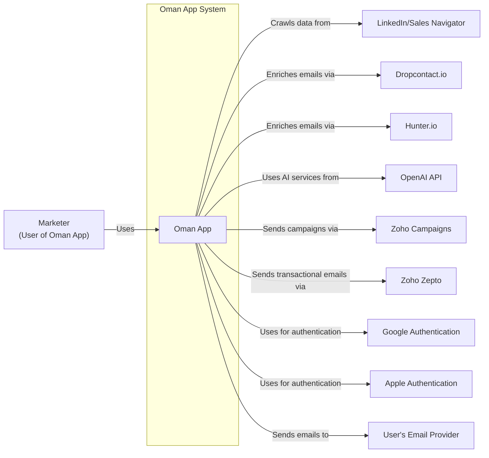
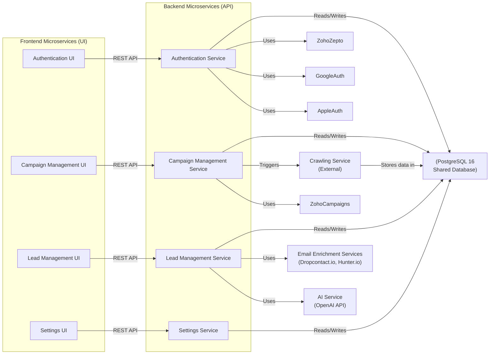
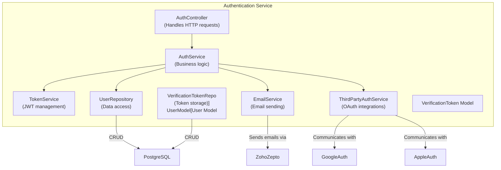
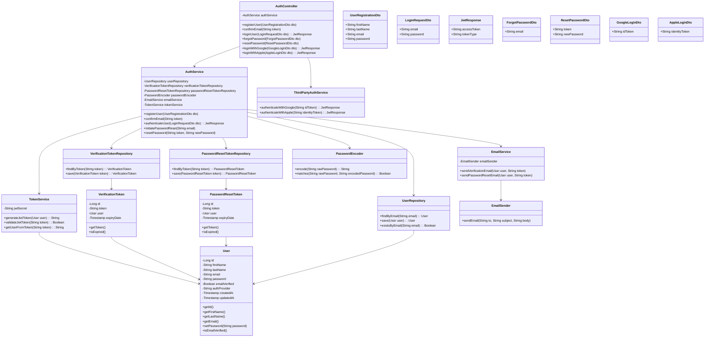

## Level 1: System Context Diagram

```mermaid
graph LR
    %% Define Users
    User["Marketer<br/>(User of Oman App)"]

    %% Define Oman App System
    subgraph "Oman App System"
        OmanApp[Oman App]
    end

    %% Define External Systems
    LinkedIn[LinkedIn/Sales Navigator]
    Dropcontact[Dropcontact.io]
    HunterIO[Hunter.io]
    OpenAI[OpenAI API]
    ZohoCampaigns[Zoho Campaigns]
    ZohoZepto[Zoho Zepto]
    GoogleAuth[Google Authentication]
    AppleAuth[Apple Authentication]
    EmailProvider[User's Email Provider]

    %% Define Relationships
    User -->|Uses| OmanApp
    OmanApp -->|Crawls data from| LinkedIn
    OmanApp -->|Enriches emails via| Dropcontact
    OmanApp -->|Enriches emails via| HunterIO
    OmanApp -->|Uses AI services from| OpenAI
    OmanApp -->|Sends campaigns via| ZohoCampaigns
    OmanApp -->|Sends transactional emails via| ZohoZepto
    OmanApp -->|Uses for authentication| GoogleAuth
    OmanApp -->|Uses for authentication| AppleAuth
    OmanApp -->|Sends emails to| EmailProvider
	%% User <--|Receives emails| EmailProvider
```

## Level 2: Container Diagram

```mermaid
graph LR
    %% Define Frontend Microservices
    subgraph "Frontend Microservices (UI)"
        AuthUI[Authentication UI]
        CampaignUI[Campaign Management UI]
        LeadUI[Lead Management UI]
        SettingsUI[Settings UI]
    end

    %% Define Backend Microservices
    subgraph "Backend Microservices (API)"
        AuthAPI[Authentication Service]
        CampaignAPI[Campaign Management Service]
        LeadAPI[Lead Management Service]
        SettingsAPI[Settings Service]
    end

    %% Define Shared Database
    PostgreSQL["(PostgreSQL 16<br/>Shared Database)"]

    %% Define External Services
    CrawlingService["Crawling Service<br/>(External)"]
    EmailEnrichment["Email Enrichment Services<br/>(Dropcontact.io, Hunter.io)"]
    AIService["AI Service<br/>(OpenAI API)"]
    ZohoCampaigns
    ZohoZepto
    GoogleAuth
    AppleAuth

    %% Frontend to Backend Relationships
    AuthUI -->|REST API| AuthAPI
    CampaignUI -->|REST API| CampaignAPI
    LeadUI -->|REST API| LeadAPI
    SettingsUI -->|REST API| SettingsAPI

    %% Backend to Database Relationships
    AuthAPI -->|Reads/Writes| PostgreSQL
    CampaignAPI -->|Reads/Writes| PostgreSQL
    LeadAPI -->|Reads/Writes| PostgreSQL
    SettingsAPI -->|Reads/Writes| PostgreSQL

    %% Backend Internal Relationships
    CampaignAPI -->|Triggers| CrawlingService
    LeadAPI -->|Uses| EmailEnrichment
    LeadAPI -->|Uses| AIService
    AuthAPI -->|Uses| ZohoZepto
    CampaignAPI -->|Uses| ZohoCampaigns

    %% Authentication Services
    AuthAPI -->|Uses| GoogleAuth
    AuthAPI -->|Uses| AppleAuth

    %% External Services to Database (if applicable)
    CrawlingService -->|Stores data in| PostgreSQL

```

## Level 3: Component Diagram (Authentication Service)

```mermaid
graph TD
    %% Authentication Service Components
    subgraph "Authentication Service"
        AuthController["AuthController<br/>(Handles HTTP requests)"]
        AuthService["AuthService<br/>(Business logic)"]
        TokenService["TokenService<br/>(JWT management)"]
        EmailService["EmailService<br/>(Email sending)"]
        ThirdPartyAuthService["ThirdPartyAuthService<br/>(OAuth integrations)"]
        UserRepository["UserRepository<br/>(Data access)"]
        VerificationTokenRepo["VerificationTokenRepo<br/>(Token storage)]
        UserModel[User Model"]
        VerificationToken[VerificationToken Model]
    end

    %% Relationships
    AuthController --> AuthService
    AuthService --> UserRepository
    AuthService --> TokenService
    AuthService --> EmailService
    AuthService --> ThirdPartyAuthService
    UserRepository -->|CRUD| PostgreSQL
    VerificationTokenRepo -->|CRUD| PostgreSQL
    EmailService -->|Sends emails via| ZohoZepto
    ThirdPartyAuthService -->|Communicates with| GoogleAuth
    ThirdPartyAuthService -->|Communicates with| AppleAuth
```

## Level 4: Code Diagram (Authentication Service)

```mermaid
classDiagram
    %% Models/Entities
    class User {
        -Long id
        -String firstName
        -String lastName
        -String email
        -String password
        -Boolean emailVerified
        -String authProvider
        -Timestamp createdAt
        -Timestamp updatedAt
        +getId()
        +getFirstName()
        +getLastName()
        +getEmail()
        +setPassword(String password)
        +isEmailVerified()
    }

    class VerificationToken {
        -Long id
        -String token
        -User user
        -Timestamp expiryDate
        +getToken()
        +isExpired()
    }

    class PasswordResetToken {
        -Long id
        -String token
        -User user
        -Timestamp expiryDate
        +getToken()
        +isExpired()
    }

    %% Repositories (Data Access Layer)
    class UserRepository {
        +findByEmail(String email): User
        +save(User user): User
        +existsByEmail(String email): Boolean
    }

    class VerificationTokenRepository {
        +findByToken(String token): VerificationToken
        +save(VerificationToken token): VerificationToken
    }

    class PasswordResetTokenRepository {
        +findByToken(String token): PasswordResetToken
        +save(PasswordResetToken token): PasswordResetToken
    }

    %% Services (Business Logic)
    class AuthService {
        -UserRepository userRepository
        -VerificationTokenRepository verificationTokenRepository
        -PasswordResetTokenRepository passwordResetTokenRepository
        -PasswordEncoder passwordEncoder
        -EmailService emailService
        -TokenService tokenService
        +registerUser(UserRegistrationDto dto)
        +confirmEmail(String token)
        +authenticateUser(LoginRequestDto dto): JwtResponse
        +initiatePasswordReset(String email)
        +resetPassword(String token, String newPassword)
    }

    class TokenService {
        -String jwtSecret
        +generateJwtToken(User user): String
        +validateJwtToken(String token): Boolean
        +getUserFromToken(String token): String
    }

    class EmailService {
        -EmailSender emailSender
        +sendVerificationEmail(User user, String token)
        +sendPasswordResetEmail(User user, String token)
    }

    class ThirdPartyAuthService {
        +authenticateWithGoogle(String idToken): JwtResponse
        +authenticateWithApple(String identityToken): JwtResponse
    }

    %% Controllers (API Layer)
    class AuthController {
        -AuthService authService
        +registerUser(UserRegistrationDto dto)
        +confirmEmail(String token)
        +loginUser(LoginRequestDto dto): JwtResponse
        +forgotPassword(ForgotPasswordDto dto)
        +resetPassword(ResetPasswordDto dto)
        +loginWithGoogle(GoogleLoginDto dto): JwtResponse
        +loginWithApple(AppleLoginDto dto): JwtResponse
    }

    %% Utilities
    class PasswordEncoder {
        +encode(String rawPassword): String
        +matches(String rawPassword, String encodedPassword): Boolean
    }

    class EmailSender {
        +sendEmail(String to, String subject, String body)
    }

    %% DTOs (Data Transfer Objects)
    class UserRegistrationDto {
        +String firstName
        +String lastName
        +String email
        +String password
    }

    class LoginRequestDto {
        +String email
        +String password
    }

    class JwtResponse {
        +String accessToken
        +String tokenType
    }

    class ForgotPasswordDto {
        +String email
    }

    class ResetPasswordDto {
        +String token
        +String newPassword
    }

    class GoogleLoginDto {
        +String idToken
    }

    class AppleLoginDto {
        +String identityToken
    }

    %% Relationships
    AuthController --> AuthService
    AuthController --> ThirdPartyAuthService
    AuthService --> UserRepository
    AuthService --> VerificationTokenRepository
    AuthService --> PasswordResetTokenRepository
    AuthService --> PasswordEncoder
    AuthService --> EmailService
    AuthService --> TokenService
    EmailService --> EmailSender
    TokenService --> User
    VerificationToken --> User
    PasswordResetToken --> User
    UserRepository --> User
    VerificationTokenRepository --> VerificationToken
    PasswordResetTokenRepository --> PasswordResetToken
```